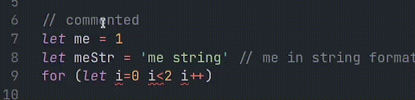
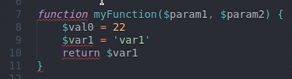

# Auto Semicolon - VSCode

This extension helps by moving to the end of the line `and/or` putting `;` in the right place. 

Both `Semicolon separated` and `Non-Semicolon separated` programming languages are supported.
It's **`auto`**, **`smart`**, **`handy`**, and **`customizable`** if you find joy in it don't forget to [🍔 donate](#-donate).

I found nothing for `PHP` so made my own, now it's the `best` for this use.

## How To Use
1. Install it from [market place > auto semicolon](https://marketplace.visualstudio.com/items?itemName=myaaghubi.auto-semicolon-vscode).
2. Use `;` just like before.

## Shortcuts
- `alt + ;` then `;` > To put `;` right in place (not auto).

    Or use command palette `ctrl+shift+p` > `Auto Semicolon > Insert At The Position`.
- `alt` + twice `;` > To ignore enclosing curly bracket pair `{..}` (force move to the end of the line)

    Or use `ctrl+shift+p` > `Auto Semicolon > Auto Insert At The End`.

## Notes
- `Multiple cursors` has been supported.
- `PHP`, `javascript`, `typescript`, `c#`, `c/c++`, `java`, `perl`, `dart`, `swift`, even `python`, `go`, `bash`, `scala`, `kotlin`, `r` supported, feel free to ask support for your programming language!

## Preview

## 🍔 Donate
Don't forget to donate if you enjoyed it ☕ 🍺 🍸 🍔

ETH: 0x0ADd51D6855d2DF11BB5F331A3fa345c67a863b2

